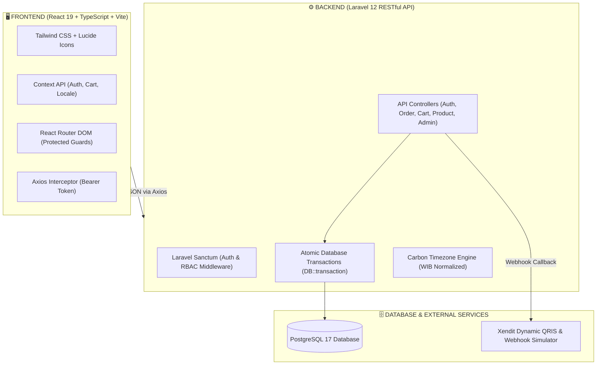
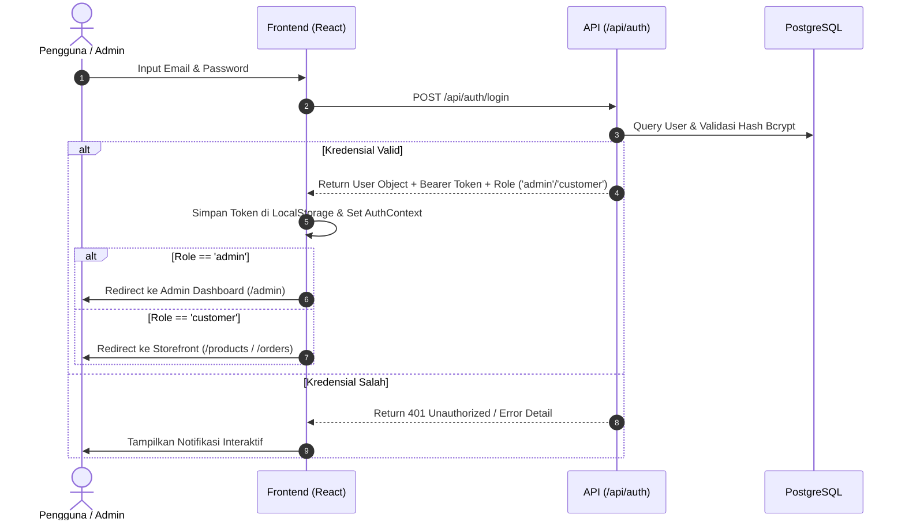
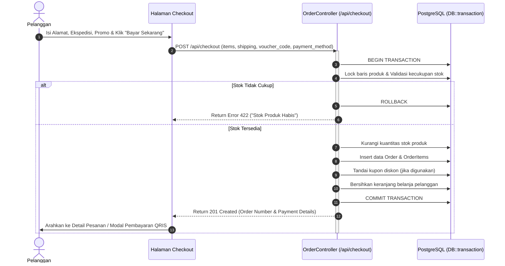
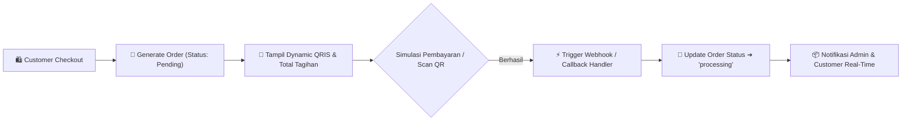
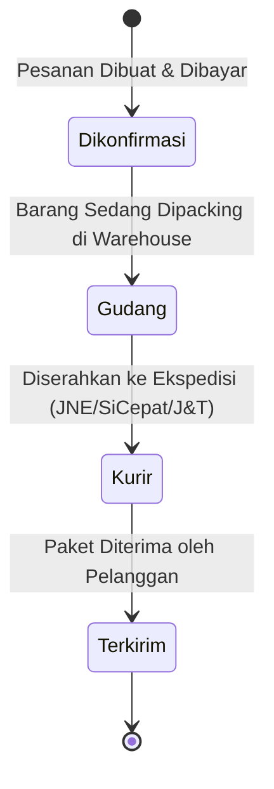

<div align="center">

# 🛍️ RENSTORE — Premium Full-Stack E-Commerce Platform
### *Modern, Scalable & High-Performance Lifestyle & Gadget Storefront*

[](https://laravel.com)
[](https://react.dev)
[](https://www.typescriptlang.org)
[](https://www.postgresql.org)
[](https://tailwindcss.com)
[](https://vitejs.dev)

<p align="center">
  <b>RENSTORE</b> adalah platform e-commerce <i>full-stack</i> tingkat enterprise yang dirancang dengan arsitektur <i>Decoupled Client-Server</i> modern. Menghadirkan performa tinggi, keamanan transaksi atomik, analitik bisnis <i>real-time</i>, integrasi payment gateway otomatis, serta desain antarmuka solid yang elegan dan intuitif.
</p>

[✨ Fitur Utama](#-fitur-utama--katalog-modul) •
[🛠️ Tech Stack](#️-arsitektur--tumpukan-teknologi) •
[🔄 Alur Kerja Sistem](#-alur-kerja-sistem-workflow-architecture) •
[🌐 REST API](#-spesifikasi-endpoint-restful-api) •
[⚡ Panduan Instalasi](#-panduan-instalasi--menjalankan-aplikasi) •
[👥 Akun Demo](#-kredensial-akun-demo)

---

</div>

## 📑 Daftar Isi
- [📌 Tentang Proyek](#-tentang-proyek)
- [🛠️ Arsitektur & Tumpukan Teknologi](#️-arsitektur--tumpukan-teknologi)
- [🔄 Alur Kerja Sistem (Workflow Architecture)](#-alur-kerja-sistem-workflow-architecture)
  - [1. Alur Autentikasi & Otorisasi RBAC](#1-alur-autentikasi--otorisasi-rbac)
  - [2. Alur Transaksi & Checkout Atomik](#2-alur-transaksi--checkout-atomik-atomic-transaction)
  - [3. Alur Verifikasi Pembayaran & Webhook](#3-alur-verifikasi-pembayaran--webhook)
  - [4. Alur Pelacakan Pengiriman Real-Time](#4-alur-pelacakan-pengiriman-real-time)
- [✨ Fitur Utama & Katalog Modul](#-fitur-utama--katalog-modul)
  - [👑 Modul Unggulan (Flagship Modules)](#-modul-unggulan-flagship-modules)
  - [🛍️ Modul Customer Storefront](#️-modul-customer-storefront)
  - [🛡️ Modul Admin Management Console](#️-modul-admin-management-console)
  - [💎 Fitur Mikro & Kenyamanan Pengguna (Micro UX)](#-fitur-mikro--kenyamanan-pengguna-micro-ux)
- [🌐 Spesifikasi Endpoint RESTful API](#-spesifikasi-endpoint-restful-api)
- [📂 Struktur Direktori Proyek](#-struktur-direktori-proyek)
- [⚡ Panduan Instalasi & Menjalankan Aplikasi](#-panduan-instalasi--menjalankan-aplikasi)
- [🛡️ Kredensial Akun Demo](#-kredensial-akun-demo)

---

## 📌 Tentang Proyek

**RENSTORE** dibangun untuk mengatasi tantangan umum dalam platform e-commerce modern: sinkronisasi stok yang rentan *race conditions*, latensi visual pada antarmuka, kompleksitas manajemen hak akses, serta integrasi pelacakan pesanan dan verifikasi pembayaran instan.

### 🎯 Nilai Inti Pengembangan:
1. **🛡️ Integritas Data Mutlak (*Zero Inventory Leak*)**: Setiap transaksi pembelian dan pembatalan diproteksi dengan `DB::transaction` berstandar ACID pada PostgreSQL.
2. **⚡ Performa Tanpa Hambatan (*Ultra-Fast UI/UX*)**: Dibangun dengan React 19 + Vite, memanfaatkan akselerasi GPU CSS (`transform-gpu`) dan transisi halus tanpa beban rendering berlebih.
3. **📊 Keputusan Bisnis Berbasis Data (*Live Analytics*)**: Admin Dashboard menyajikan metrik penjualan, grafik interaktif multi-filter, dan auto-sync data berkala.
4. **🌐 Aksesibilitas Luas (*Bilingual & Responsive*)**: Dukungan multi-bahasa instan (Indonesia & English) dengan desain adaptif sempurna dari smartphone hingga monitor ultra-wide.

---

## 🛠️ Arsitektur & Tumpukan Teknologi

Aplikasi ini menggunakan pola arsitektur **Decoupled Client-Server (Headless RESTful Architecture)** yang memisahkan sepenuhnya lapisan presentasi (Frontend) dari lapisan logika bisnis dan basis data (Backend).



### 💻 1. Frontend Technology Stack
| Teknologi | Versi | Peran & Alasan Penggunaan |
|---|---|---|
| **React** | `19.x` | Library UI inti berbasis komponen deklaratif untuk rendering reaktif berkecepatan tinggi. |
| **TypeScript** | `5.x` | Menjamin kepastian tipe data statis (*strict type-safety*), meminimalisir *runtime error*, dan meningkatkan skalabilitas kode. |
| **Vite** | `6.x` | Bundler dan *development server* modern dengan Hot Module Replacement (HMR) sub-milidetik. |
| **Tailwind CSS** | `3.x` | Framework utility-first untuk desain presisi, responsif, dan konsisten tanpa overhead stylesheet berlebih. |
| **Lucide React** | `Latest` | Kumpulan icon SVG modern yang bersih, konsisten, dan berukuran ringan. |
| **Axios** | `1.x` | HTTP client modular yang dilengkapi konfigurasi *interceptor token* otomatis untuk setiap request API. |
| **Framer Motion** | `12.x` | Engine animasi deklaratif untuk transisi halaman dan interaksi modal yang natural. |
| **Canvas Confetti** | `1.x` | Efek visual partikel perayaan interaktif saat pengguna berhasil mengklaim voucher. |
| **Font Plus Jakarta Sans** | `Self-Hosted` | Tipografi sans-serif geometris modern untuk estetika antarmuka kelas atas. |

### ⚙️ 2. Backend Technology Stack
| Teknologi | Versi | Peran & Alasan Penggunaan |
|---|---|---|
| **PHP** | `8.2 / 8.5+` | Bahasa pemrograman backend dengan performa tinggi dan fitur modern type-hinting. |
| **Laravel** | `12.x` | Framework PHP enterprise berstandar industri dengan arsitektur MVC, Eloquent ORM, dan routing ekspresif. |
| **Laravel Sanctum** | `Latest` | Sistem autentikasi berbasis token API (Bearer Token) yang ringan, cepat, dan aman. |
| **PostgreSQL** | `17.x` | Relational Database Management System (RDBMS) tangguh berfitur lengkap untuk integritas relasi data e-commerce. |
| **Eloquent ORM** | `Native` | Abstraksi interaksi database berbasis model dengan relasi *One-to-Many*, *BelongsTo*, dan *Pivot Tables*. |
| **Carbon** | `Native` | Penanganan waktu terstandardisasi dengan penyesuaian zona waktu Indonesia (**WIB / UTC+7**). |

---

## 🔄 Alur Kerja Sistem (Workflow Architecture)

### 1. Alur Autentikasi & Otorisasi RBAC
Sistem menerapkan **Role-Based Access Control (RBAC)** ketat untuk membedakan hak akses Customer dan Administrator.



---

### 2. Alur Transaksi & Checkout Atomik (Atomic Transaction)
Mencegah terjadinya pengurangan stok ganda (*double spending/race condition*) saat banyak pembeli melakukan checkout bersamaan.



---

### 3. Alur Verifikasi Pembayaran & Webhook
Simulasi integrasi gateway pembayaran Xendit Dynamic QRIS dengan update status instan.



---

### 4. Alur Pelacakan Pengiriman Real-Time
Modul pelacak logistik cerdas yang mengonversi status kurir menjadi visual multi-step progress bar.



---

## ✨ Fitur Utama & Katalog Modul

### 👑 Modul Unggulan (Flagship Modules)

#### 1. 📊 Real-Time Admin Analytics & Interactive Charting
- **KPI Metrics Dashboard**: Tinjauan performa bisnis mencakup total omset penjualan (*Revenue*), volume order, *Average Order Value (AOV)*, pelanggan aktif, dan stok total produk.
- **Visualisasi Dinamis Multi-Filter**:
  - **Hari Ini (Today)**: Analisis fluktuasi per slot 4 jam (00:00–04:00, 04:00–08:00, dst).
  - **7 Hari Terakhir**: Performa harian lengkap dengan identifikasi hari puncak penjualan (*Peak Day*).
  - **Bulanan & Tahunan**: Evaluasi tren pertumbuhan omset jangka panjang.
- **Interactive SVG Chart**: Dilengkapi *dual-metric line*, titik hover responsif, dan ringkasan tingkat keberhasilan pesanan (*Success Rate %*).
- **Background Live Polling**: Sinkronisasi data otomatis setiap 5 detik tanpa perlu me-refresh halaman.

#### 2. 🚚 Pelacak Pengiriman Interaktif (*Dynamic Shipment Tracker*)
- **Multi-Ekspedisi Terintegrasi**: Simulasi pelacakan kurir populer Indonesia (**JNE Express, SiCepat, J&T Express, Pos Indonesia, dan GoSend**).
- **Visual Multi-Step Timeline**: Indikator tahapan visual 4 langkah dari konfirmasi hingga barang sampai di tangan penerima.
- **Log Perjalanan Real-Time**: Riwayat timestamp, lokasi transit pos, nama kurir operasional, dan tombol salin nomor resi 1-klik.

#### 3. 👥 Manajemen Pengguna & Hak Akses Admin (`/admin/users`)
- **Pusat Kendali Akun**: Menampilkan seluruh data pengguna terdaftar beserta statistik belanja (*Total Belanja Rp, Jumlah Pesanan, Status Role*).
- **Quick Role Switcher**: Admin dapat menaikkan atau menurunkan role akun antara `customer` dan `admin`.
- **Direct Password Reset**: Membantu pelanggan mereset kata sandi langsung dari panel admin jika kehilangan akses.
- **Safe Delete Protection**: Perlindungan bawaan yang mencegah admin menghapus akunnya sendiri secara tidak sengaja.

#### 4. 🎟️ Engine Voucher Eksklusif (Proteksi 1 Email = 1 Klaim)
- **Klaim Diskon VIP 50% (`DISKON50`)**: Form newsletter interaktif di footer yang memvalidasi ke database.
- **Anti-Duplikasi Ketat**: Satu email hanya diizinkan mengklaim voucher satu kali. Upaya klaim kedua akan memicu modal peringatan informatif.
- **Efek Konfeti Sinematik**: Perayaan visual saat klaim berhasil dengan tombol salin kode otomatis.

#### 5. 🔑 Sistem Pemulihan Password Mandiri (`/forgot-password`)
- **4-Step Recovery Flow**: Input Email ➔ Verifikasi Kode OTP 6 Digit ➔ Input Password Baru ➔ Selesai & Auto-Login.
- **Token Kedaluwarsa Otomatis**: Kode OTP berlaku selama 15 menit dengan enkripsi di database `password_reset_tokens`.

#### 6. 🌐 Sistem Bilingual (Multi-Bahasa ID / EN)
- Pengalihan bahasa instan di seluruh komponen, form, modal, dan pesan error tanpa memuat ulang aplikasi melalui `LocaleContext`.

---

### 🛍️ Modul Customer Storefront

| Fitur | Deskripsi Teknis & Kemampuan |
|---|---|
| **Katalog & Filter Produk** | Pencarian instan teks penuh (*live search*), filter kategori dinamis, dan opsi sortir harga termurah/termahal/terbaru. |
| **Halaman Flash Sale** | Menampilkan produk diskon khusus dengan *Live Countdown Timer* penghitung mundur waktu promo. |
| **Detail Produk Komprehensif** | Galeri gambar beresolusi tinggi, status ketersediaan stok, deskripsi spesifikasi, serta rekomendasi produk terkait. |
| **Keranjang Belanja Reaktif** | Sinkronisasi jumlah kuantitas dengan batas stok database, perhitungan subtotal otomatis, dan badge navbar real-time. |
| **Checkout Fleksibel** | Dukungan pemilihan alamat lengkap, opsi ekspedisi pengiriman, input voucher diskon, dan metode pembayaran lengkap. |
| **Riwayat Pesanan & Detail Invoice** | Pelacakan status pesanan pelanggan (*Menunggu Pembayaran, Diproses, Dikirim, Selesai, Dibatalkan*) dan cetak invoice digital. |
| **Portal Artikel & Lifestyle Blog** | Halaman artikel wawasan teknologi, tren fashion, tips gadget, dan estimasi waktu baca artikel. |
| **Pengaturan Profil Pengguna** | Pembaruan data diri, nomor telepon, alamat default, serta ganti foto profil avatar. |

---

### 🛡️ Modul Admin Management Console

| Fitur | Deskripsi Teknis & Kemampuan |
|---|---|
| **Katalog Produk (CRUD)** | Tambah produk baru, edit harga/deskripsi/gambar, kontrol stok, serta peringatan *Low Stock Alert* (<= 5 unit). |
| **Kategori Produk (CRUD)** | Tambah, edit, dan hapus kategori beserta otomatisasi pembuatan slug URL unik. |
| **Kelola Transaksi & Pesanan** | Pemantauan semua pesanan masuk, filter status, dan pembaruan alur proses pesanan. |
| **Auto-Restock on Cancellation** | Mekanisme cerdas pengembalian stok barang secara otomatis ke katalog saat admin membatalkan pesanan. |
| **Manajemen Pengguna** | Monitor aktivitas customer, ubah role, reset kata sandi, dan kelola akun pengguna. |

---

### 💎 Fitur Mikro & Kenyamanan Pengguna (Micro UX)

- 🚀 **GPU-Accelerated Transitions**: Animasi interaktif tombol dan kartu menggunakan `transform-gpu` untuk frame rate stabil 60 FPS.
- 📋 **1-Click Smart Copy**: Tombol salin nomor resi kurir, kode promo, dan ID pesanan dengan notifikasi visual *"Tersalin!"*.
- 🔄 **Smart Login & Register Error Handlers**: Banner error interaktif yang mengarahkan pengguna langsung ke registrasi jika email belum terdaftar, atau ke login jika email sudah ada.
- 🔝 **Automatic Scroll to Top**: Pengembalian posisi scroll secara mulus ke posisi atas layar setiap kali pengguna berpindah rute.
- 📱 **Collapsible Sidebar & Mobile Drawer**: Sidebar admin yang dapat diciutkan serta navigasi mobile modern dengan latar blur (*backdrop-blur*).

---

## 🌐 Spesifikasi Endpoint RESTful API

### 🔐 Autentikasi & Pengguna Publik
```http
POST   /api/auth/register               # Mendaftarkan akun customer baru
POST   /api/auth/login                  # Autentikasi login & penerbitan Bearer Token
POST   /api/auth/forgot-password        # Meminta kode OTP 6 digit pemulihan password
POST   /api/auth/reset-password         # Reset password menggunakan kode OTP
POST   /api/newsletter/claim-voucher    # Klaim kupon diskon member (1 email = 1 klaim)
```

### 👤 Customer Terautentikasi (`Bearer Token`)
```http
GET    /api/auth/profile                # Mengambil data profil pengguna aktif
PUT    /api/auth/profile                # Memperbarui informasi profil & avatar
POST   /api/auth/logout                 # Menghapus token & mengakhiri sesi
GET    /api/cart                        # Mengambil isi keranjang belanja
POST   /api/cart                        # Menambahkan produk ke keranjang
PUT    /api/cart/{id}                   # Mengubah kuantitas item keranjang
DELETE /api/cart/{id}                   # Menghapus item dari keranjang
POST   /api/promo/validate              # Validasi kupon promo saat checkout
POST   /api/checkout                    # Checkout pesanan (Atomic DB Transaction)
GET    /api/orders                      # Riwayat seluruh pesanan milik user
GET    /api/orders/{order_number}       # Detail spesifik satu pesanan
```

### 🛍️ Katalog Produk & Kategori (Publik)
```http
GET    /api/categories                  # Daftar seluruh kategori aktif
GET    /api/products                    # Katalog produk (Filter, Search, Sort)
GET    /api/products/{slug}             # Detail lengkap satu produk
```

### 🛡️ Administrator Portal (`Role: admin`)
```http
GET    /api/admin/dashboard/stats       # Statistik analitik & dataset grafik real-time
GET    /api/admin/users                 # Daftar pengguna terdaftar & ringkasan metrik
POST   /api/admin/users/{id}/reset-password # Reset kata sandi pengguna langsung oleh admin
PATCH  /api/admin/users/{id}/role       # Mengubah peran pengguna (admin / customer)
DELETE /api/admin/users/{id}            # Menghapus akun pengguna dari sistem
GET    /api/admin/orders                # Mengambil seluruh pesanan pelanggan
PATCH  /api/admin/orders/{id}/status    # Update status pesanan (dengan auto-restock)
POST   /api/admin/products              # Menambahkan produk baru ke katalog
PUT    /api/admin/products/{id}         # Mengedit data produk & menambah stok
DELETE /api/admin/products/{id}         # Menghapus produk dari katalog
POST   /api/admin/categories            # Membuat kategori produk baru
DELETE /api/admin/categories/{id}       # Menghapus kategori produk
```

---

## 📂 Struktur Direktori Proyek

```
renstore-project/
├── backend/                              # ⚙️ Aplikasi Backend (Laravel 12 API)
│   ├── app/
│   │   ├── Http/Controllers/Api/
│   │   │   ├── AdminUserController.php   # Manajemen Akun & Hak Akses Pengguna
│   │   │   ├── AuthController.php        # Register, Login, OTP Forgot Password & Voucher
│   │   │   ├── CartController.php        # Logika Keranjang Belanja
│   │   │   ├── CategoryController.php    # Manajemen Kategori Produk
│   │   │   ├── DashboardController.php   # Analitik Realtime & Dataset Grafik Line
│   │   │   ├── OrderController.php       # Checkout Atomik & Riwayat Pesanan
│   │   │   ├── ProductController.php     # Katalog Produk & Manajemen Stok
│   │   │   └── WebhookController.php     # Callback Simulasi Payment Gateway
│   │   ├── Models/                      # Model Eloquent (User, Product, Order, dll)
│   │   └── Middleware/CheckRole.php     # Proteksi Role Admin & Customer
│   ├── database/
│   │   ├── migrations/                  # Skema Tabel PostgreSQL
│   │   └── seeders/                     # Seeder Data Awal (Kategori, Produk, Akun)
│   └── routes/
│       └── api.php                      # Registrasi Rute RESTful API
│
├── frontend/                             # 🖥️ Aplikasi Frontend (React 19 + Vite)
│   ├── public/fonts/                    # Font Lokal Plus Jakarta Sans
│   ├── src/
│   │   ├── api/axios.ts                 # Axios Instance dengan Token Interceptor
│   │   ├── components/
│   │   │   ├── admin/
│   │   │   │   └── RealtimeLineChart.tsx # Komponen Grafik SVG Interaktif Admin
│   │   │   ├── AdminRoute.tsx           # Route Guard Khusus Administrator
│   │   │   ├── ProtectedRoute.tsx       # Route Guard Customer Login
│   │   │   ├── Navbar.tsx               # Header, Pencarian, & Pemilih Bahasa
│   │   │   ├── Footer.tsx               # Footer & Form Klaim Voucher VIP
│   │   │   ├── ProductCard.tsx          # Komponen Kartu Produk
│   │   │   └── ShipmentTracker.tsx      # Komponen Pelacak Resi Kurir Real-Time
│   │   ├── contexts/                    # State Management Terpusat
│   │   │   ├── AuthContext.tsx          # State Autentikasi Pengguna & Role
│   │   │   ├── CartContext.tsx          # State Keranjang Belanja Global
│   │   │   └── LocaleContext.tsx        # State Bahasa (ID & EN)
│   │   ├── layouts/
│   │   │   ├── AdminLayout.tsx          # Layout Dashboard Admin (Sidebar + Header)
│   │   │   └── MainLayout.tsx           # Layout Storefront Customer
│   │   ├── pages/                       # Seluruh Halaman Antarmuka Pengguna
│   │   │   ├── admin/                   # Halaman Konsol Admin (Dashboard, Users, dll)
│   │   │   ├── CatalogPage.tsx          # Katalog Produk
│   │   │   ├── CheckoutPage.tsx         # Checkout & Pembayaran
│   │   │   ├── FlashSalePage.tsx        # Halaman Diskon Kilat
│   │   │   ├── ForgotPasswordPage.tsx   # Pemulihan Sandi (OTP 6 Digit)
│   │   │   ├── HomePage.tsx             # Halaman Beranda Utama
│   │   │   ├── OrdersPage.tsx           # Riwayat Pesanan Customer
│   │   │   └── ProfilePage.tsx          # Manajemen Profil Pengguna
│   │   ├── routes/AppRoutes.tsx         # Konfigurasi Rute & Perutean Halaman
│   │   └── types/                       # Definisi Tipe TypeScript
│   └── index.html                       # Entry Point HTML Aplikasi
│
├── PROJECT_DOCUMENTATION.md             # Dokumentasi Teknis Internal Proyek
└── README.md                            # Panduan Utama Repositori
```

---

## ⚡ Panduan Instalasi & Menjalankan Aplikasi

### 📋 Prasyarat Sistem
Pastikan perangkat Anda telah terpasang dependensi berikut:
- **PHP**: `^8.2` atau lebih baru
- **Composer**: Dependency Manager PHP
- **Node.js**: `^18.x` atau `^20.x` & **npm**
- **PostgreSQL**: `^15.x` atau `^17.x`

---

### 1️⃣ Konfigurasi & Menjalankan Backend (Laravel API)

1. Masuk ke direktori backend:
   ```bash
   cd backend
   ```
2. Pasang dependensi PHP:
   ```bash
   composer install
   ```
3. Salin file environment:
   ```bash
   cp .env.example .env
   ```
4. Sesuaikan konfigurasi database PostgreSQL pada file `.env`:
   ```env
   DB_CONNECTION=pgsql
   DB_HOST=127.0.0.1
   DB_PORT=5432
   DB_DATABASE=renstore_db
   DB_USERNAME=postgres
   DB_PASSWORD=password_anda
   ```
5. Buat application key, jalankan migrasi tabel, dan isi data seeder:
   ```bash
   php artisan key:generate
   php artisan migrate:fresh --seed
   ```
6. Jalankan server backend:
   ```bash
   php artisan serve
   ```
   *Backend API aktif berjalan di:* **`http://127.0.0.1:8000`**

---

### 2️⃣ Konfigurasi & Menjalankan Frontend (React Vite)

1. Buka terminal baru dan masuk ke direktori frontend:
   ```bash
   cd frontend
   ```
2. Pasang seluruh dependensi node modules:
   ```bash
   npm install
   ```
3. Jalankan server pengembangan Vite:
   ```bash
   npm run dev
   ```
   *Frontend Storefront aktif dibuka di browser pada:* **`http://localhost:5173`**

---

## 🛡️ Kredensial Akun Demo

Untuk mempermudah pengujian seluruh alur aplikasi, gunakan akun demo bawaan hasil seeder berikut:

| Peran (Role) | Email Akun | Kata Sandi | Akses Halaman |
|---|---|---|---|
| 👑 **Administrator** | `admin@renstore.com` | `admin123` | Portal Admin (`/admin`), Dashboard Analitik, Kelola Produk, Orders & Pengguna |
| 🛍️ **Customer** | `customer@renstore.com` | `password123` | Storefront Belanja, Keranjang, Checkout, dan Riwayat Pesanan |

> 💡 **Kupon Diskon Bawaan yang Dapat Digunakan:**
> - `DISKON50` : Potongan diskon 50% (Dapat diklaim via form voucher di footer).
> - `RENSTORE2026` : Potongan promo diskon belanja Rp 50.000.

---

<div align="center">

*Dikembangkan dengan dedikasi untuk menghadirkan standar e-commerce modern, cepat, dan terpercaya.*

**© 2026 RENSTORE. All Rights Reserved.**

</div>
