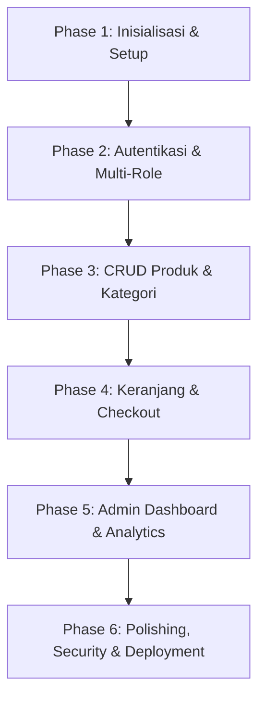

# 🛍️ RENSTORE E-Commerce Platform — Project Roadmap

Dokumentasi arsitektur dan peta jalan pengembangan (Development Roadmap) aplikasi E-Commerce Fullstack **RENSTORE**.

---

## 🏗️ Tech Stack & Infrastructure

- **Backend**: Laravel 12 (PHP 8.5) REST API with Laravel Sanctum
- **Database**: PostgreSQL 17 (`rendy` on `127.0.0.1:5432`)
- **Frontend**: React 19 + Vite + Tailwind CSS
- **State & HTTP**: Axios, React Router Dom, Lucide React

---

## 🗺️ Roadmap Fase Pengembangan



---

### ✅ Phase 1: Inisialisasi & Setup Environment *(Selesai)*
- [x] Inisialisasi proyek Laravel backend di folder `./backend`.
- [x] Konfigurasi environment database PostgreSQL (`DB_CONNECTION=pgsql`, DB `rendy`).
- [x] Eksekusi migrasi tabel awal (`php artisan migrate`).
- [x] Setup Laravel Sanctum & API routing (`php artisan install:api`).
- [x] Inisialisasi frontend React Vite di folder `./frontend`.
- [x] Instalasi & konfigurasi Tailwind CSS, Axios, Lucide React, dan React Router DOM.
- [x] Pembuatan helper API Axios dengan token interceptor (`src/api/axios.js`).

---

### 🚀 Phase 2: Autentikasi & Multi-Role Authorization (Customer & Admin)
- [x] **Backend API**:
  - [x] Pembuatan kolom/role pada tabel `users` (`customer`, `admin`).
  - [x] Endpoint Registrasi Akun Customer (`POST /api/auth/register`).
  - [x] Endpoint Login Customer & Admin (`POST /api/auth/login`).
  - [x] Endpoint Profil User Aktif (`GET /api/auth/profile`).
  - [x] Endpoint Logout & Revoke Sanctum Token (`POST /api/auth/logout`).
  - [x] Middleware proteksi route Admin (`CheckRole`).
- [ ] **Frontend**:
  - [ ] Auth Context / State Management (Penyimpanan Token & Data Pengguna).
  - [ ] Halaman Login & Registrasi dengan form validasi interaktif.
  - [ ] Route Guards (`ProtectedRoute` untuk Customer, `AdminRoute` untuk Admin).

---

### 📦 Phase 3: CRUD Produk & Kategori
- [x] **Backend API**:
  - [x] Migrasi & Model: `Category`, `Product` (dengan indeks PostgreSQL dan relasi Eloquent).
  - [x] CRUD Kategori: `GET`, `POST`, `PUT`, `DELETE` `/api/categories` & `/api/admin/categories`.
  - [x] CRUD Produk: `GET`, `POST`, `PUT`, `DELETE` `/api/products` & `/api/admin/products`.
  - [x] Filter pencarian (`search`), filter kategori (`category_slug`, `category_id`), sortir harga (`price_asc`, `price_desc`, `latest`), dan Pagination.
  - [x] Mock Seeders: `CategorySeeder` dan `ProductSeeder` dengan 15+ item & foto Unsplash HD.
- [ ] **Frontend**:
  - [ ] Halaman Katalog Produk (Grid View, Filter Kategori, Sortir Harga).
  - [ ] Halaman Detail Produk (Galeri gambar, pemilihan varian/ukuran, deskripsi, stok).
  - [ ] Panel Admin untuk Manajemen Produk & Kategori (Form tambah/edit dengan file preview).

---

### 🛒 Phase 4: Keranjang Belanja & Alur Checkout
- [x] **Backend API**:
  - [x] Migrasi & Model: `CartItem`, `Order`, `OrderItem` (dengan indeks PostgreSQL dan relasi Eloquent).
  - [x] Endpoint Manajemen Keranjang (`GET`, `POST`, `PUT`, `DELETE` `/api/cart` dengan validasi limit stok).
  - [x] Endpoint Checkout & Order Creation (`POST /api/checkout` dengan atomic DB Transaction, kalkulasi harga DB, pengurangan stok otomatis, & pembersihan keranjang).
  - [x] Endpoint Riwayat & Detail Pesanan Customer (`GET /api/orders`, `GET /api/orders/{order_number}`).
  - [x] Endpoint Manajemen Status Pesanan Admin (`GET /api/admin/orders`, `PATCH /api/admin/orders/{id}/status` dengan auto-restoration stok saat pembatalan).
- [ ] **Frontend**:
  - [ ] Slide-over Drawer / Halaman Keranjang Belanja dengan kalkulasi subtotal otomatis.
  - [ ] Halaman Checkout (Input alamat pengiriman, opsi kurir/ongkir, metode pembayaran).
  - [ ] Halaman Invoice & Riwayat Pesanan Customer.

---

### 📊 Phase 5: Admin Dashboard & Grafik Penjualan
- [x] **Backend API**:
  - [x] Endpoint Statistik & Ringkasan: Total Pendapatan, Total Order, Produk Terlaris, Pelanggan Baru (`GET /api/admin/dashboard/stats`).
  - [x] Endpoint Grafik Penjualan Bulanan 6 Bulan Terakhir (`monthly_sales` aggregation).
  - [x] Endpoint Manajemen Status Pesanan (Pending, Processing, Completed, Cancelled).
- [x] **Frontend Architecture & Contexts**:
  - [x] Contexts: `AuthContext.tsx` & `CartContext.tsx` dengan TypeScript type definitions lengkap.
  - [x] Route Guards: `ProtectedRoute`, `AdminRoute`, `GuestRoute`.
  - [x] Layouts: `MainLayout` (Customer & Public) dan `AdminLayout` (Dedicated Admin Sidebar & Console).
  - [x] Pages: `HomePage`, `LoginPage`, `RegisterPage`, `ProductsPage`, `CartPage`, `OrdersPage`, dan `AdminDashboardPage`.

---

### 🌟 Phase 6: Frontend UI Components, Pages & Fullstack Integration
- [x] **Reusable UI Components**:
  - [x] Navbar: Logo RENSTORE, Search Bar interaktif, dropdown kategori, keranjang belanja dengan badge reactive counter, dan profil akun.
  - [x] Footer: Value propositions, tautan kategori, jaminan keamanan belanja, dan arsitektur tech stack.
  - [x] ProductCard: Hover zoom, kategori badge, format Rupiah IDR, dan tombol direct Add-to-Cart.
  - [x] SkeletonLoader: Loading cards, table rows, dan detail pages.
- [x] **Halaman Customer & Publik**:
  - [x] `HomePage.tsx`: Hero banner, Kategori pilihan, dan Grid produk terpopuler.
  - [x] `CatalogPage.tsx`: Sidebar filter kategori, live keyword search, sortir harga, dan kontrol paginasi.
  - [x] `ProductDetailPage.tsx`: Galeri gambar, quantity counter, deskripsi lengkap, Add-to-Cart, dan rekomendasi produk terkait.
  - [x] `CartPage.tsx`: Tabel keranjang belanja, kontrol kuantitas (+ / -), kalkulasi subtotal otomatis, dan checkout trigger.
  - [x] `CheckoutPage.tsx`: Form alamat pengiriman, kontak telepon, catatan kurir, ringkasan belanja, dan invoice modal popup sukses.
  - [x] `OrderHistoryPage.tsx`: Riwayat pesanan akun customer dan detail status tracking per pesanan.
  - [x] `LoginPage.tsx` & `RegisterPage.tsx`: Form autentikasi modern dengan 1-click Demo Account button (Admin & Customer).
- [x] **Halaman Admin Portal**:
  - [x] `AdminDashboardPage.tsx`: Metrik KPI (Omset, Orders, Produk, Pelanggan), bar chart penjualan bulanan, dan tabel pesanan masuk.
  - [x] `AdminProductsPage.tsx`: Tabel katalog produk, modal tambah produk baru, modal edit produk, dan hapus produk.
  - [x] `AdminCategoriesPage.tsx`: Manajemen kategori produk dengan upload URL gambar cover dan toggle status aktif.
  - [x] `AdminOrdersPage.tsx`: Manajemen pesanan masuk dan dropdown perubahan status transaksi (*pending* -> *processing* -> *completed* / *cancelled* dengan auto restock).

---

## 📁 Struktur Direktori Proyek

```
renstore-project/
├── backend/                  # REST API Laravel
│   ├── app/
│   │   ├── Http/Controllers/ # API Controllers
│   │   └── Models/          # Eloquent Models (User, Product, Category, Order, etc.)
│   ├── routes/
│   │   ├── api.php          # REST API Routes
│   │   └── web.php
│   └── database/
│       └── migrations/      # PostgreSQL Database Migrations
│
├── frontend/                 # Client React Vite SPA (TypeScript)
│   ├── src/
│   │   ├── api/             # Axios API Client (`axios.ts`)
│   │   ├── components/      # Reusable UI Components
│   │   ├── layouts/         # Layout Wrapper (Customer, Admin)
│   │   ├── pages/           # Application Views & Pages
│   │   ├── types/           # TypeScript Type Definitions
│   │   ├── App.tsx          # Main App Component
│   │   ├── main.tsx         # Entry Point
│   │   └── index.css        # Tailwind CSS Stylesheet
│   ├── tsconfig.json        # TypeScript Configuration
│   └── vite.config.ts       # Vite & Tailwind Plugins Configuration
│
└── ROADMAP.md                # Panduan & Roadmap Pengembangan Proyek
```
